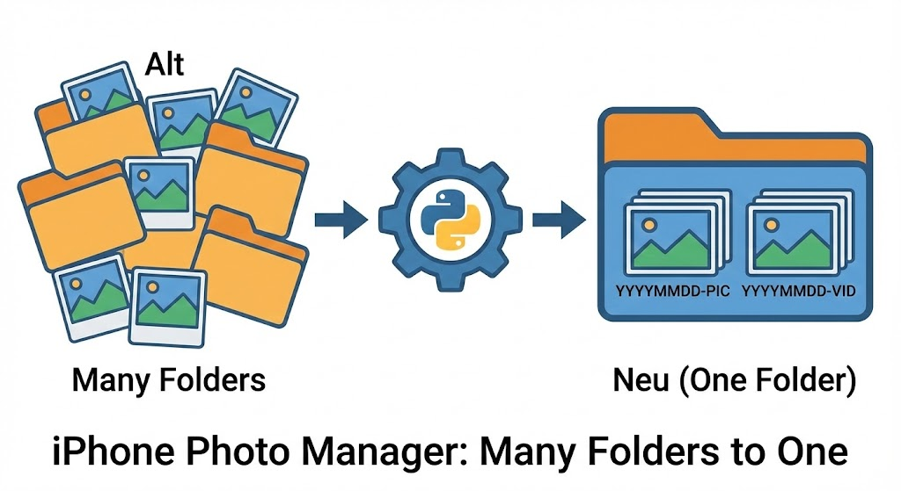

# 🛠️ Kleine Skript Toolbox

Skripte und Automatisierungen, die den Alltag zwischen Linux-Terminals und Windows-PowerShell erleichtern. Alle Tools sind darauf ausgelegt, Ordnung ins digitale Chaos zu bringen.

* * *

## 🐧 Linux Skripte (Zorin OS & Co.)

Tools für die Linux-Welt, meist in Python oder Bash geschrieben. Der Fokus liegt auf System-Optimierung und Medien-Management.

| **Kurzbeschreibung** | **Vorschau** | **Download** |
| --- | --- | --- |
| **[iPhone Photo Manager](README-iphone-manager.md):** Rekursive Apple-Backups chronologisch sortieren, global nummerieren und mit einem 1971-Anker-Datum für Sorgenkinder versehen. |  | [iphone-photo-manager.py](Photo-Manager/iphone-photo-manager.py) |
|     |     |     |

* * *

## 🪟 Windows Skripte

Diese Sammlung umfasst PowerShell- und Batch-Skripte zur Systempflege und Automatisierung von Windows-Prozessen.

| **Kurzbeschreibung** | **Vorschau** | ****Download**** |
| --- | --- | --- |
|     |     |     |

* * *

## 💡 Über diese Sammlung

Alle Skripte folgen einem Standard:

- **Sicherheit zuerst:** Operationen werden vorzugsweise als Kopie ausgeführt, bevor Originale angefasst werden.
    
- **Transparenz:** Jedes Installations-Skript enthält zwingend den passenden Deinstallations-Befehl.
    
- **Ordnung:** Verwendung von globalen Zählern und standardisierten Zeitstempeln (YYYYMMDD).
    

* * *
